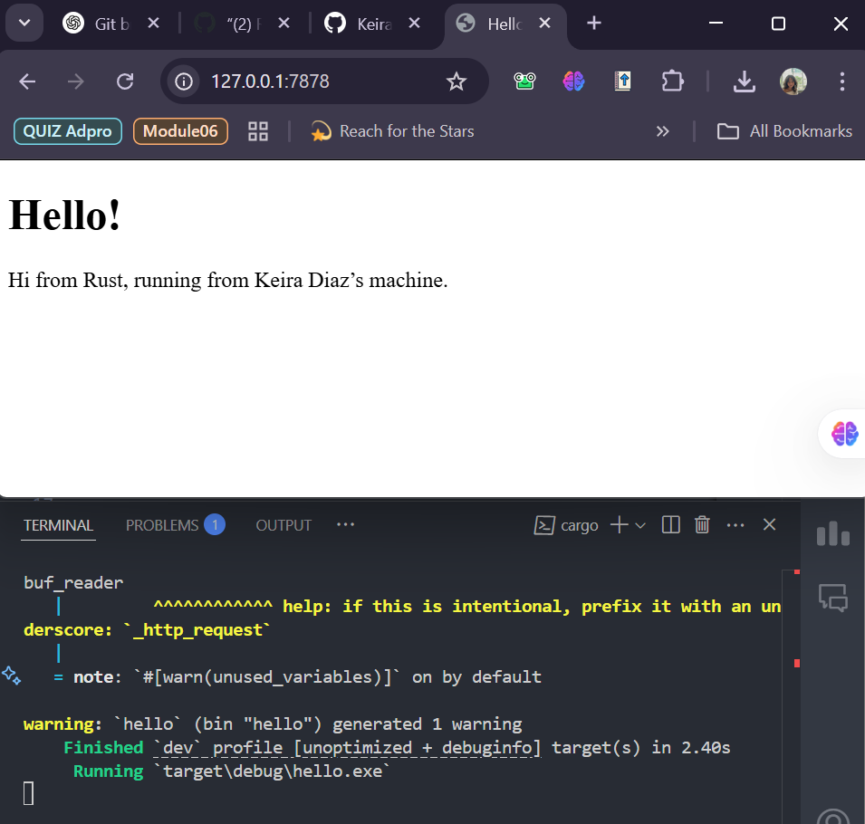

# Module 6 - Concurrency

## Contents
1. **Reflections**
    - [Milestone 1](#reflection-1)
    - [Milestone 2](#reflection-2)
    - [Milestone 3](#reflection-3)
    - [Milestone 4](#reflection-4)
    - [Milestone 5](#reflection-5)

## Reflection 1: 
### Single-Threaded Web Server

In building a single-threaded web server, two main protocols are involved: **Hypertext Transfer Protocol (HTTP)** and **Transmission Control Protocol (TCP)**. These protocols operate on a **request-response** principle, meaning the server receives a request from the client and responds accordingly.  

**TCP** is a low-level protocol that defines how data is transferred between servers but does not specify the content of the data. On the other hand, **HTTP** is responsible for structuring the request and response content. HTTP data is transmitted over TCP.  

Initially, the program can only handle browser requests by using `TcpListener` to listen for connections on `127.0.0.1:7878`. Every time a connection is received, the program prints `"Connection established!"`.  

### Key Concepts:
- **`bind()`**: Associates a `TcpListener` with a specific address and port on the local machine, allowing it to listen for incoming connections.  
- **`unwrap()`**: Extracts the value from a `Result` or `Option`. If the result is `Ok` or `Some`, it returns the contained value. However, if the result is `Err` or `None`, calling `unwrap()` will cause the program to panic and terminate, indicating a critical error.  
- **`incoming()`**: Retrieves incoming connections on `TcpListener`, returning an iterator that yields `Result<TcpStream, Error>`. Each element represents a stream, which is an open connection between the client and server. The server processes these connections sequentially, handling one at a time.  

To define how the server should respond to browser requests, a function called **`handle_connection()`** is implemented. This function processes the incoming HTTP request, and at the end, the console displays the HTTP request message.  

Additionally, a **`BufReader`** is used to read lines from the `TcpStream` using the `lines()` method. The `http_request` variable collects the lines of the HTTP request received from the browser.

## Reflection 2: 
### Returning HTML Content

The `handle_connection` function is responsible for processing client requests and sending back an appropriate response. It does this by reading the contents of `hello.html` using `fs::read_to_string`, which loads the file into a string. This allows the server to send an HTML page as part of the response.  

### **Steps:**
1. **Read the HTML file** – `fs::read_to_string("hello.html")` loads the file content into a string.  
2. **Create the HTTP Response** – A status line `"HTTP/1.1 200 OK"` is set, along with a `Content-Length` header to indicate the size of the content. The HTML file content is then added as the response body.  
3. **Send the Response** – The complete response (status line, headers, and body) is written to the `TcpStream` using `write_all()`, ensuring it is fully sent to the client.  

This allows the server to serve web pages when accessed by a browser. 

## Reflection 3: 
###  Validating request and selectively responding

Initially, the web server always returned the **hello.html** page regardless of the incoming request. Now, we have added functionality to verify whether the browser is requesting **"/"** before sending a response. If the request does not match, the server will return a **404 status code** along with a **404.html** error page.  

**Implementation Explanation**  

1. **Using `buf_reader.lines()`**  
   - `lines()` generates an iterator over the lines in the **BufReader**.  

2. **Extracting the first request line**  
   - `next()` retrieves the first element from the iterator.  
   - The first `unwrap()` handles the possible `Option` returned by `next()`.  
   - The second `unwrap()` handles the `Result` returned by `lines()`.  

**Final Outcome**  
- **If the user accesses `/`**, the server returns **hello.html** with a **200 OK status code**.  
- **If the user accesses any other route**, the server returns **404.html** with a **404 NOT FOUND status code**.  
- **The code is cleaner and more maintainable** by avoiding repeated variable declarations (`status_line` and `contents`).  

This implementation aligns with **clean code principles and maintainability**, ensuring that the server can handle requests efficiently. 

## Reflection 4: 
### Simulation slow response

Here, we will simulate a **slow response** in the _web server_ by introducing a performance bottleneck through a **`/sleep`** route.  

When this route is accessed, the server invokes **`thread::sleep()`**, pausing for **10 seconds** before sending a response. This demonstrates how a **single-threaded server** handles delays or heavy processing loads, where a single slow request can block the entire server.  

To test this, we open **two browser windows** and compare the behavior of the **`/`** and **`/sleep`** endpoints. If we load **`/`** while **`/sleep`** is still processing, we observe that **`/`** remains unresponsive until **`/sleep`** completes its **10-second delay**. This behavior highlights the **limitations of a single-threaded architecture**, as it prevents the server from efficiently handling multiple concurrent requests.  

Through this experiment, I realized the importance of **multithreading and asynchronous processing** in real-world web servers. Without concurrency, slow or blocked requests can significantly degrade overall performance. This exercise helped me understand the relationship between **concurrency and server performance**, reinforcing why modern web servers must incorporate **efficient parallel processing techniques** to remain scalable and responsive. 

## Reflection 5: 
### Multithreaded Server with ThreadPool

We upgraded the web server from **single-threaded** to **multi-threaded** using **ThreadPool**. This allows multiple requests to be processed at the same time, improving performance.  

**How ThreadPool Works**  
- **Manages multiple threads** to handle incoming tasks.  
- Each `Worker` has:  
  - A **unique ID**  
  - A `thread*`
  - A `JoinHandle<()>` to manage execution  

**How Tasks Are Processed**  
1. **ThreadPool Initialization**  
   - Creates a **vector of Workers**.  
   - Uses a **channel** to send tasks to Workers.  

2. **Task Execution**  
   - `execute()` sends tasks through the `channel`.  
   - Workers receive tasks and run them.  
   - `Mutex` ensures safe access to shared resources.  

With **ThreadPool**, the web server is now faster, scalable, and more responsive. 